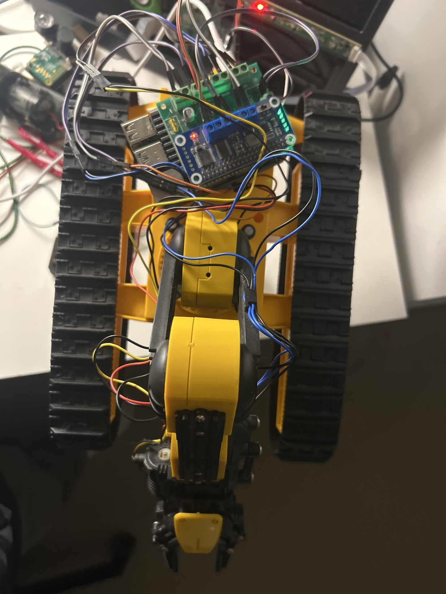

# ARGOS

<p align="center">
  
</p>

A Raspberry Pi–controlled tracked robot with a 4-joint articulated arm, being built up toward autonomous operation under the direction of a remote multimodal LLM.

---

## Hardware

| Component | Part |
|-----------|------|
| Chassis | New Bright PowerHorse tracked base |
| Arm | OWI-535 Robotic Arm Edge (re-motored) |
| Computer | Raspberry Pi 4 (`argos.local`) |
| Track controller | Waveshare Motor Driver HAT (PCA9685 + TB6612FNG, I2C 0x40) |
| Arm controller | SB Components MotorShield (2× L293DD, GPIO) |

<p align="center">
  
</p>

The arm is a cannibalised OWI-535 — original motors and control board replaced with DC motors wired to the MotorShield. Shoulder, elbow, wrist, and gripper are each independently driven.

---

## What works today

- Both tracks verified on hardware — forward, backward, turns, pivots
- Elbow, wrist, and gripper verified on hardware
- Shoulder under investigation (connector/mechanical fault)
- `SafetyMonitor` wraps all motors with speed clamping and watchdog auto-stop
- Interactive test scripts: `motor_jog.py`, `jig.py`, `test_all_motors_manual.py`

---

## Repository layout

```
argos/
  config.py         — central motor config (IDs, speed limits, watchdog durations)
  drivers/          — low-level: I2CMotor (tracks) and GPIOMotor (arm)
  base/tracks.py    — TrackedBase: forward/backward/turn/pivot/stop
  arm/joints.py     — RobotArm: shoulder, elbow, wrist, gripper
  safety/monitor.py — SafetyMonitor: speed clamping + watchdog (entry point for all motion)
  vision/           — [planned] USB webcam capture, ArUco pose tracking
  arm/kinematics.py — [planned] forward + inverse kinematics
  mcp/              — [planned] MCP server for LLM control
tests/              — hardware test and jog scripts
docs/               — schematics, reference docs, design notes, photos
```

---

## Getting started

Requires a Raspberry Pi with I2C enabled and SPI disabled.

```bash
pip install -r requirements.txt
```

```python
from argos.safety.monitor import SafetyMonitor

safety = SafetyMonitor()
try:
    safety.base.forward(60)        # both tracks, 60 % — auto-stops after 10 s
    safety.arm.elbow.run(40)       # elbow extend, 40 % — auto-stops after 3 s
    safety.emergency_stop()        # kills everything immediately
finally:
    safety.close()
```

Test scripts (run on the Pi):

```bash
python3 tests/test_all_motors_manual.py   # step through every motor interactively
python3 tests/motor_jog.py gpio 2 50 1.0  # jog elbow at 50 % for 1 s
python3 tests/jig.py                      # random motor sequence
```

---

## Roadmap

| Phase | What | Status |
|-------|------|--------|
| 1 | Drivers, controllers, safety layer, hardware bring-up | **Done** |
| 2a | Vision — USB webcam + ArUco arm pose tracking | Next |
| 2b | Kinematics — FK + IK for `move_arm(x, y, z)` | Planned |
| 2c | Planner — coordinated base + arm goal execution | Planned |
| 2d | Safety upgrade — vision-based joint angle limits | Planned |
| 2e | Sensorium — coarse-to-fine target acquisition (IMU, sonar, IR, floor-plane) | Planned |
| 3 | MCP server — expose tools to remote LLM over network | Planned |

See [`docs/roadmap.md`](docs/roadmap.md) for the full forward plan including hardware procurement and camera boom design options.

---

## Documentation

| Doc | Contents |
|-----|----------|
| [`CLAUDE.md`](CLAUDE.md) | AI context: architecture, pin tables, conventions, status |
| [`docs/roadmap.md`](docs/roadmap.md) | Forward plan, procurement list, camera boom design |
| [`docs/camera_mount.md`](docs/camera_mount.md) | Camera placement, FOV, ArUco marker sizing |
| [`docs/owi535_ik_reference.md`](docs/owi535_ik_reference.md) | IK algorithm reference (Debenec 2015) |
| [`DEVLOG.md`](DEVLOG.md) | Session-by-session development log |
